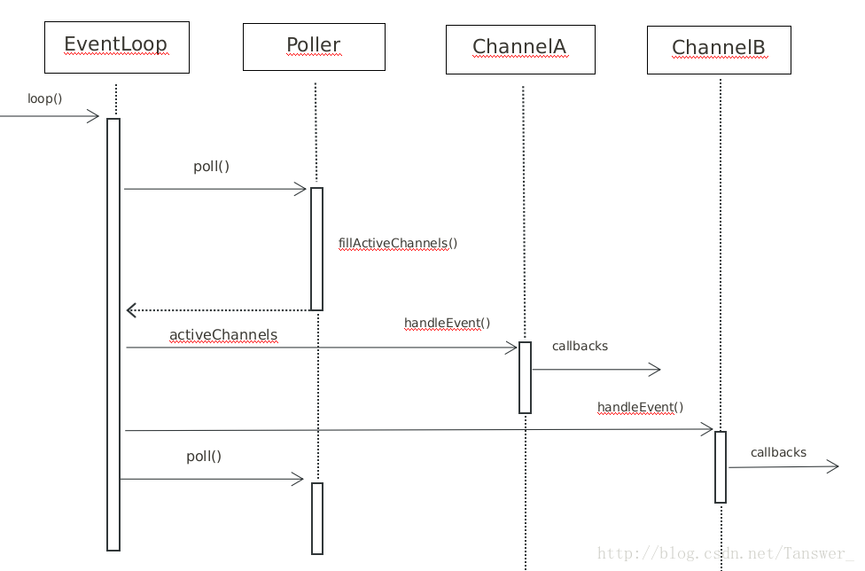

* content
{:toc}

Webserver开发日志（版本2）
====

增加部分
----
参考muduo增加了Reactor模式，但写的并不完美，有待改进
* Channel:事件分发器，将每个触发的事件封装在这里，然后通过回调函数执行对应的事件操作
* Epoll:封装了epoll操作，将epoll_wait封装成返回Channel类型.
* EventLoop:事件循环，一个线程一个loop，对于每个事件通过handleEvent执行对应的操作.

待解决问题
----
* Reactor模型写得比较简陋，之后考虑完善
* 部分代码不够完美，会提高一定常量的时间复杂度，暂时不处理
* 可能还有部分bug

Reactor的运行过程大致如下
----

